ModQuik is a convenient tool that allows Teaching Assistants(TAs) to keep track of their classes, monitor their students' grades and set up reminders for their tasks (such as creating tutorial slides or marking homework).
ModQuik is optimised for use via a Command Line Interface (CLI) while still having the benefits of a Graphical User Interface (GUI).
ModQuik can get one's lesson management tasks done faster than traditional GUI apps if one is a fast typist.

* Table of Contents
{:toc}

--------------------------------------------------------------------------------------------------------------------

## **1. Acknowledgements**

* This project is based on the [AddressBook-Level3](https://github.com/se-edu/addressbook-level3) project created by the [SE-EDU initiative](https://se-education.org).
* Libraries used: [JavaFX](https://openjfx.io/), [Jackson](https://github.com/FasterXML/jackson), [JUnit5](https://github.com/junit-team/junit5)
* Icons used in this project are obtained from [flaticon](https://www.flaticon.com/)

--------------------------------------------------------------------------------------------------------------------

## **2. Setting up, getting started**

Refer to the guide [_Setting up and getting started_](SettingUp.md).

--------------------------------------------------------------------------------------------------------------------

## **3. About this Developer Guide**

**Warning Box**

**:exclamation: Warning:** I am an example warning box! I show important messages to take note to avoid any unintended effects.

**Highlights**  
Highlighted text refers to commands, parameters, fields values or any user inputs.
e.g. [`commands`](#glossary) [`PARAMETERS`](#glossary)

--------------------------------------------------------------------------------------------------------------------

## **4. Design**

:bulb: **Tip:** The `.puml` files used to create diagrams in this document can be found in the [diagrams](https://github.com/AY2223S1-CS2103T-W17-3/tp/tree/master/docs/diagrams/) folder. Refer to the [_PlantUML Tutorial_ at se-edu/guides](https://se-education.org/guides/tutorials/plantUml.html) to learn how to create and edit diagrams.

### 4.1 Architecture

The ***Architecture Diagram*** given above explains the high-level design of the App.

Given below is a quick overview of main components and how they interact with each other.

**Main components of the architecture**

**`Main`** has two classes called [`Main`](https://github.com/AY2223S1-CS2103T-W17-3/tp/blob/master/src/main/java/seedu/modquik/Main.java) and [`MainApp`](https://github.com/AY2223S1-CS2103T-W17-3/tp/blob/master/src/main/java/seedu/modquik/MainApp.java). It is responsible for,
* At app launch: Initializes the components in the correct sequence, and connects them up with each other.
* At shut down: Shuts down the components and invokes cleanup methods where necessary.

[**`Commons`**](#common-classes) represents a collection of classes used by multiple other components.

The rest of the App consists of four components.

* [**`UI`**](#ui-component): The UI of the App.
* [**`Logic`**](#logic-component): The command executor.
* [**`Model`**](#model-component): Holds the data of the App in memory.
* [**`Storage`**](#storage-component): Reads data from, and writes data to, the hard disk.

**How the architecture components interact with each other**

The *Sequence Diagram* below shows how the components interact with each other for the scenario where the user issues the command `delete student 1`.

Each of the four main components (also shown in the diagram above),

* defines its *API* in an `interface` with the same name as the Component.
* implements its functionality using a concrete `{Component Name}Manager` class (which follows the corresponding API `interface` mentioned in the previous point.

For example, the `Logic` component defines its API in the `Logic.java` interface and implements its functionality using the `LogicManager.java` class which follows the `Logic` interface. Other components interact with a given component through its interface rather than the concrete class (reason: to prevent outside component's being coupled to the implementation of a component), as illustrated in the (partial) class diagram below.

The sections below give more details of each component.

### 4.2 UI component

The **API** of this component is specified in [`Ui.java`](https://github.com/AY2223S1-CS2103T-W17-3/tp/tree/master/src/main/java/seedu/modquik/ui/Ui.java)

The UI consists of a `MainWindow` that is made up of parts e.g.`CommandBox`, `ResultDisplay`, `StudentListPanel`, `StatusBarFooter` etc. All these, including the `MainWindow`, inherit from the abstract `UiPart` class which captures the commonalities between classes that represent parts of the visible GUI.

The `UI` component uses the JavaFx UI framework. The layout of these UI parts are defined in matching `.fxml` files that are in the `src/main/resources/view` folder. For example, the layout of the [`MainWindow`](https://github.com/AY2223S1-CS2103T-W17-3/tp/tree/master/src/main/java/seedu/modquik/ui/MainWindow.java) is specified in [`MainWindow.fxml`](https://github.com/AY2223S1-CS2103T-W17-3/tp/tree/master/src/main/resources/view/MainWindow.fxml)

The `UI` component,

* executes user commands using the `Logic` component.
* listens for changes to `Model` data so that the UI can be updated with the modified data.
* keeps a reference to the `Logic` component, because the `UI` relies on the `Logic` to execute commands.
* depends on some classes in the `Model` component, as it displays `Student`, `Reminder`, `Tutorial`, `Consultation` object residing in the `Model`.

### 4.3 Logic component

**API** : [`Logic.java`](https://github.com/AY2223S1-CS2103T-W17-3/tp/tree/master/src/main/java/seedu/modquik/logic/Logic.java)

Here's a (partial) class diagram of the `Logic` component:

How the `Logic` component works:
1. When `Logic` is called upon to execute a command, it uses the `ModQuikParser` class to parse the user command.
1. This results in a `Command` object (more precisely, an object of one of its subclasses e.g., `AddStudentCommand`) which is executed by the `LogicManager`.
1. The command can communicate with the `Model` when it is executed (e.g. to add a student).
1. The result of the command execution is encapsulated as a `CommandResult` object which is returned from `Logic`.

The Sequence Diagram below illustrates the interactions within the `Logic` component for the `execute("delete student 1")` API call.

:information_source: **Note:** The lifeline for `DeleteStudentCommandParser` should end at the destroy marker (X) but due to a limitation of PlantUML, the lifeline reaches the end of diagram.

Here are the other classes in `Logic` (omitted from the class diagram above) that are used for parsing a user command:

How the parsing works:
* When called upon to parse a user command, the `ModQuikParser` class creates an `XYZCommandParser` (`XYZ` is a placeholder for the specific command name e.g., `AddCommandParser`) which uses the other classes shown above to parse the user command and create a `XYZCommand` object (e.g., `AddStudentCommand`) which the `ModQuikParser` returns back as a `Command` object.
* All `XYZCommandParser` classes (e.g., `AddStudentCommandParser`, `DeleteStudentCommandParser`, ...) inherit from the `Parser` interface so that they can be treated similarly where possible e.g, during testing.

### 4.4 Model component
**API** : [`Model.java`](https://github.com/AY2223S1-CS2103T-W17-3/tp/tree/master/src/main/java/seedu/modquik/model/Model.java)

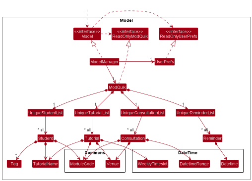

**Student component:**

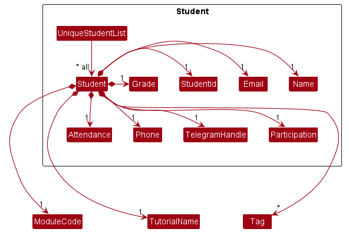

**Consultation component:**

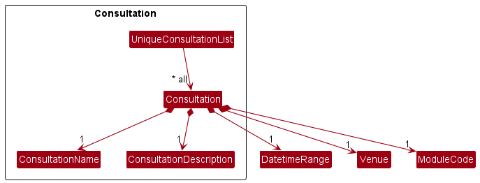

**Reminder component:**

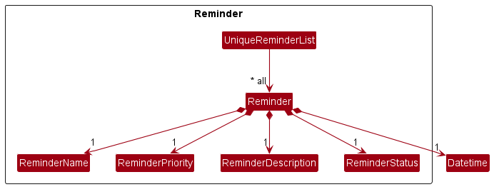

The `Model` component,

* stores the mod quik data i.e., all `Student` objects (which are contained in a `UniqueStudentList` object), `Tutorial`, `Consultation`, `Reminder` objects
* stores the currently 'selected' `Student` objects (e.g., results of a search query) as a separate _filtered_ list which is exposed to outsiders as an unmodifiable `ObservableList<Student>` that can be 'observed' e.g. the UI can be bound to this list so that the UI automatically updates when the data in the list change.
* stores a `UserPref` object that represents the user’s preferences. This is exposed to the outside as a `ReadOnlyUserPref` objects.
* does not depend on any of the other three components (as the `Model` represents data entities of the domain, they should make sense on their own without depending on other components)

### 4.5 Storage component

**API** : [`Storage.java`](https://github.com/AY2223S1-CS2103T-W17-3/tp/blob/master/src/main/java/seedu/modquik/storage/Storage.java)

The `Storage` component,
* can save both ModQuik data and user preference data in json format, and read them back into corresponding objects.
* inherits from both `ModQuikStorage` and `UserPrefStorage`, which means it can be treated as either one (if only the functionality of only one is needed).
* depends on some classes in the `Model` component (because the `Storage` component's job is to save/retrieve objects that belong to the `Model`)

### 4.6 Common classes

Classes used by multiple components are in the `seedu.modquik.commons` package.

--------------------------------------------------------------------------------------------------------------------

## **5. Implementation**

This section describes some noteworthy details on how certain features are implemented.

### 5.1 Add Student Feature

This feature allows a TA to add a student to the student list.

#### Current Implementation

The implementation of the `add student` command involves creating new Student objects and storing them in the modquik.json using the JsonAdaptedStudent class.

The add student command has the following fields:

* n/ prefix followed by the name of the student
* i/ prefix followed by the student id
* ph/ prefix followed by the student's phone number
* e/ prefix followed by the student's email
* tele/ prefix followed by the student's telegram handle
* m/ prefix followed by the module code
* tut/ prefix followed by the tutorial name
* g/ prefix followed by the student's grade (Optional)
* att/ prefix followed by the student's attendance score (Optional)
* part/ prefix followed by the student's participation score (Optional)
* t/ prefix followed by relevant tags (Optional)

The system will validate the parameters supplied by the user. When input validation fails, error message specifying the first identified error will be shown to the user.

The following sequence diagram shows how the `add student` command works:

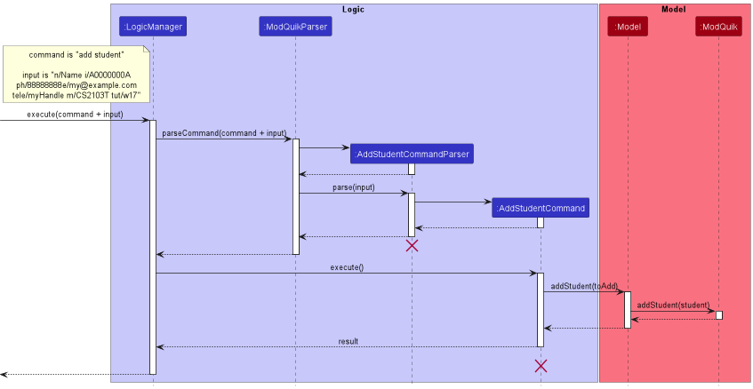

:information_source: **Note:**
`add tutorial`, `add consultation` and `add reminder` commands work similar to the above but have different fields.

The following activity diagram illustrates what happens when the `add student` command is executed. ModQuik will check if the given student id does not already exist.

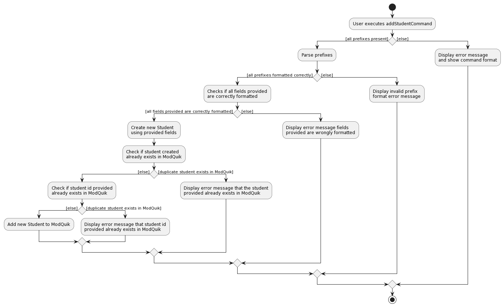

**NOTE:** Fields used in `add student` command are name, student id, phone, email, telegram handle, module, tutorial, and grade(if any), attendance(if any), participation (if any), tags (if any).

Referencing the above activity diagram, ModQuik will first check that all prefixes are present and formatted correctly. It will then proceed to check if all fields provided are formatted correctly. After that, it creates a Student object using the provided fields and then check if there is a duplicate student inside ModQuik. If there are no duplicate student inside ModQuik, it will check across every student in ModQuik to see if the provided student id already exists inside ModQuik. If the provided student id does not belong to any student inside ModQuik already, the created student is then added into ModQuik and a message is returned indicating success. The new student will appear in the ModQuik.

### 5.2 Edit Student Feature

This feature allows a TA to edit a student in the displayed student list.

#### Current Implementation

The implementation of the `edit student` command involves creating new Student objects and replacing the previous Student object to be edited as identified by the user.

The edit student command has the following fields. All fields are optional but at least one must be provided:

* n/ prefix followed by the name of the student
* i/ prefix followed by the student id
* ph/ prefix followed by the student's phone number
* e/ prefix followed by the student's email
* tele/ prefix followed by the student's telegram handle
* m/ prefix followed by the module code
* tut/ prefix followed by the tutorial name
* g/ prefix followed by the student's grade
* att/ prefix followed by the student's attendance score
* part/ prefix followed by the student's participation score
* t/ prefix followed by relevant tags

The system will validate the parameters supplied by the user. When input validation fails, error message specifying the first identified error will be shown to the user.

The following sequence diagram shows how the `edit student` command works:

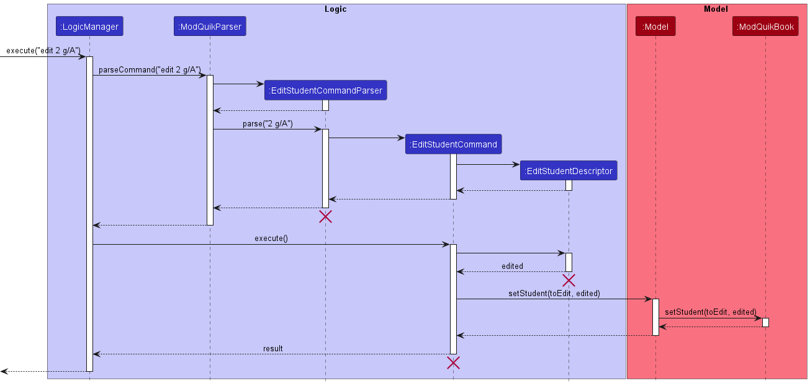

:information_source: **Note:**
`edit tutorial`, `edit consultation` and `edit reminder` commands work similar to the above but have different fields.

### 5.3 Delete Student Feature

This feature allows a TA to delete a student in the displayd student list.

#### Current Implementation

The implementation of the `delete student` command involves deleting the Student object identified by the user.

The following sequence diagram shows how the `delete student` command works:

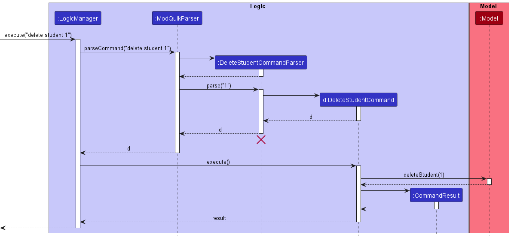

The following activity diagram illustrates what happens when the `delete student` command is executed.
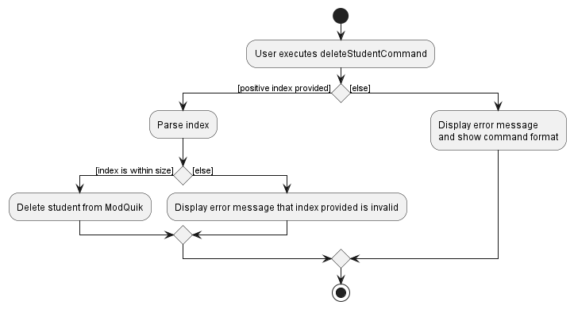

:information_source: **Note:**
`delete tutorial`, `delete consultation` and `delete reminder` commands work similar to the above.

### 5.4 Find Student Feature

The implementation of the `find` command to find students, allows the user to see a filtered list of students.
The filtering is based on an AND search, for example, `find n/John m/CS2103T` will show only students that have "John" in their name and are also from the CS2103T module.

#### Implementation
The filtering logic is done with predicate classes that implement Java's Predicate interface.

The following sequence diagrams shows how the `find` command works.
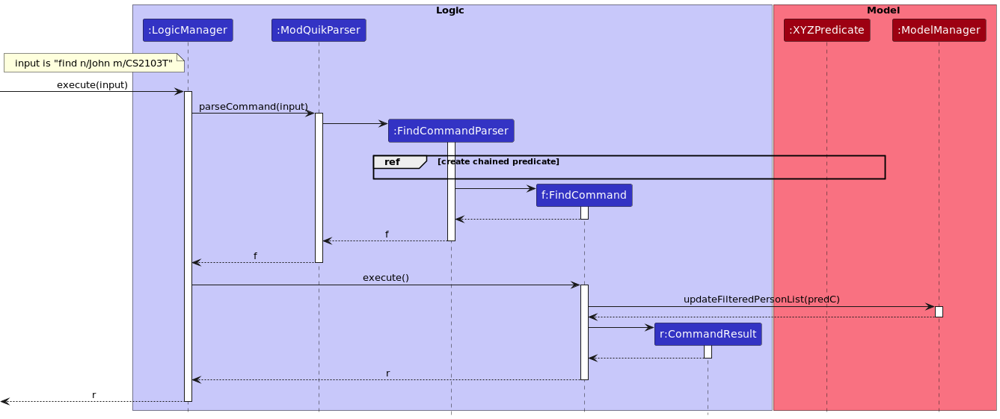
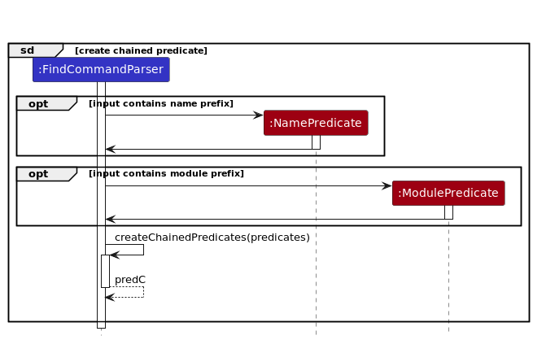

When a user enters `find n/John m/CS2103T`, the FindCommandParser created will parse the tags in the command.
For each valid tag, it creates the respective XYZPredicate. In the example command, there are two search criteria
corresponding to name and module, hence a `NamePredicate` and a `ModulePredicate` is created.

These predicates are stored in a `List`, which is passed to the `createChainedPredicates` internal method that combines the predicates in the AND sense.
The resulting predicate is a `Predicate<Student>`, and the call to its constructor is not shown in the diagram for brevity.
The predicate, henceforth referred as `predC`, is stored passed to `FindCommand` constructor.

When the `FindCommand` is executed, it calls the updates the model using `predC`. Hence, the model's student list
now only contains selected students.

### 5.5 Grade Chart Feature

This feature allows a TA to navigate to view the grade chart of students without the use of a mouse. This is crucial as our target users are fast typists who prefer typing to other means of input.

#### Current Implementation

The following sequence diagram shows how the show grade command works.

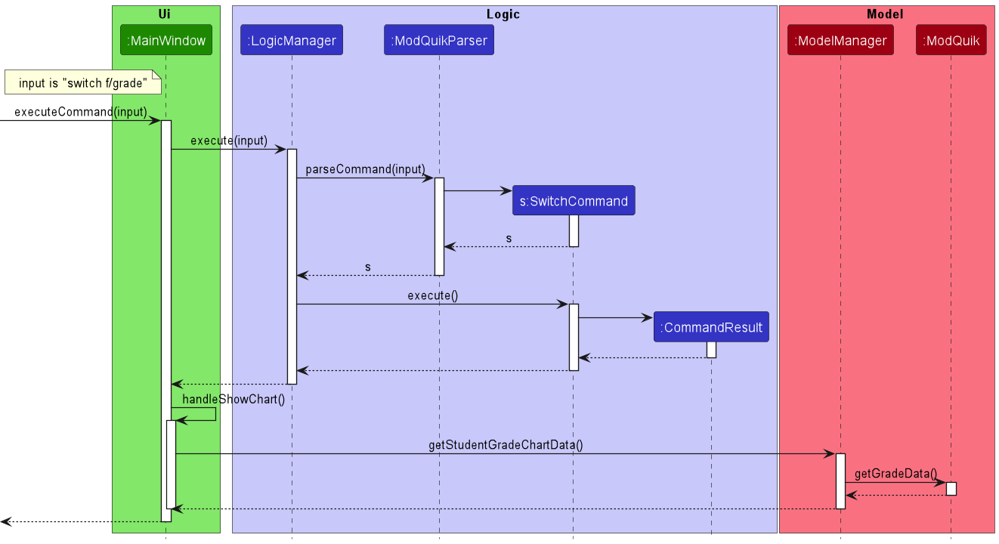

The `SwitchCommand#execute()` returns the `CommandResult(MESSAGE_SUCCESS_GRADE, GRADE_CHART)` that is returned to `LogicManager` and passed to `MainWindow`. The `MainWindow` then calls `handleShowChart()` which calls `ModelManager#getStudentGradeChartData()` to get the data and then update the main display to grade chart.

`GRADE_CHART` is an element in enumeration `ModelType` which determines what content is displayed in main screen.

### 5.6 Extract emails

This feature allows a TA to easily mass email a selected group of students. A typical workflow is as such:
1. Use the `find` command to show a selected group of students of interest.
2. Use the `extract emails` command to generate a [deep link](https://en.wikipedia.org/wiki/Deep_linking), which is copied to the clipboard
3. When the deep link is opened in the browser, the user is redirected to NUS WebMail with a draft email and selected recipients.

#### Current Implementation
The following sequence diagram shows how the extract emails command works. As it is a high-level diagram, `Ui`, `Logic` and `Model` refer to
components in ModQuik, rather than classes. `Clipboard` refers to the Java 11 Clipboard class.

Upon the user issuing the `extract emails` command, an `ExtractEmailCommand` is created. This step is not shown in the sequence diagram for breivity.

When the command is executed, the current list of students shown is retrieved from Model as an ObservableList of students.
This list is passed to the helper method `generateUrl`, which creates the deeplink required. This link is then pasted to the system clipboard via
an instance of Clipboard's method `setContent`.

An alternative is to generate a [mailto:](https://en.wikipedia.org/wiki/Mailto) link instead of deep links. However, it seems that Outlook Online
does not attach itself as a mailto: handler.

### 5.7 Sort reminder
This feature allows a TA to sort the list of reminders by a given criteria. TA could either choose to sort by
* priority
* deadline

If priority is chosen, reminders will be sorted from `HIGH` to `MEDIUM` to `LOW`, whereas if deadline is chosen, reminders will be sorted chronologically from earliest to latest.

#### Current Implementation
 It is implemented by the SortReminderCommandParser and SortReminderCommand classes. 
`SortReminderCommandParser` is responsible for parsing and validating the parameters inputted by the user while `SortReminder` class is responsible for sorting the reminders in the reminder list. 
 The following sequence diagram shows how the `sort reminder` works.

1. The user enters `sort reminders by/priority` command in main window to sort the reminders by priority.
2. `LogicManager#execute` will then call `ModQuikParser#parseCommand` method, which then calls `SortReminderCommandParser#parse` method.
3. `SortReminderCommandParser` will check the parameter inputted by the user, and create a new instance of `SortReminderCommand` with the corresponding sorting criteria.
4. `SortReminderCommandParser` will return the new `SortReminderCommand` instance to `ModQuikParser`, which in turns return to `LogicManager`.
5. `LogicManager` calls `SortReminderCommand#execute` method, which will then call either `Model#sortReminderByPriority()` or `Model#sortReminderByDeadline()` depending on the criteria that was initialised with the `SortReminderCommand`.
6. Reminder list will then be sorted according to the given criteria.
7. The `SortReminderCommand` then creates a new instance of `CommandResult` and return it to `LogicManager`.

--------------------------------------------------------------------------------------------------------------------

## **6. Documentation, logging, testing, configuration, dev-ops**

* [Documentation guide](Documentation.md)
* [Testing guide](Testing.md)
* [Logging guide](Logging.md)
* [Configuration guide](Configuration.md)
* [DevOps guide](DevOps.md)

--------------------------------------------------------------------------------------------------------------------

## **7. Appendix: Requirements**

### 7.1 Product scope

**Target user profile**: NUS teaching assistants (TAs).

**Value proposition**: we want to evolve AB3 such that the fast-typist TAs are able to manage all the information of their teaching modules in one place including students' information, grade summary, tutorials, consultations and reminders. This allows TAs to keep track of their responsibilities, students’ progress and schedules for the ongoing semester.
### 7.2 User stories

Priorities: High (must have) - `* * *`, Medium (nice to have) - `* *`, Low (unlikely to have) - `*`

| Priority | As a …​            | I want to …​                                    | So that I can…​                                                                          |
|----------|--------------------|-------------------------------------------------|------------------------------------------------------------------------------------------|
| `* * *`  | teaching assistant | add student into my classes                     | track the list of students in my classes                                                 |
| `* * *`  | teaching assistant | list all my students                            | see all the students that I have                                                         |
| `* * `   | teaching assistant | edit a student's information                    | update any changes to a student's information quickly                                    |
| `* * *`  | teaching assistant | delete a student from my classes                | remove students who decide to drop the module                                            |
| `* * `   | teaching assistant | clear all students in my classes                | clear all students at once after a semester                                              |
| `* * *`  | teaching assistant | mark students' attendance                       | see cumulative class attendance grade at the end of the semester                         |
| `* * *`  | teaching assistant | mark students' participation                    | see the cumulative class participation grade at the end of the semester                  |
| `* * *`  | teaching assistant | see a pie chart summarizing my students' grades | keep track of my students' performances                                                  |
| `* *`    | teaching assistant | extract students' emails                        | mass email a group of students                                                           |
| `* * *`  | teaching assistant | find a student by their name                    | get a student information quickly without having to go through the entire list           |
| `* * *`  | teaching assistant | find a student by their student ID              | get their name quickly while grading their assignments without having to go through the entire list |
| `* * *`  | teaching assistant | find a student by their tutorial                | locate details of all students in the same tutorial without having to go through the entire list |
| `* * *`  | teaching assistant | find a student by their module                  | locate details of of all students in the same module without having to go through the entire list |
| `* * *`  | teaching assistant | add a new tutorial slot                         | track the list of tutorials that I have                                                  |
| `* * `   | teaching assistant | edit a tutorial slot                            | update the details of an existing tutorial quickly                                       |
| `* * *`  | teaching assistant | delete a tutorial slot                          | remove unwanted tutorials                                                                |
| `* *`    | teaching assistant | clear all tutorial slots                        | clear all tutorial at once after a semester                                              |
| `* * *`  | teaching assistant | add a new consultation slot                     | track the list of consultations that I have                                              |
| `* *`    | teaching assistant | edit a consultation slot                        | update the details of an existing consultation quickly                                   |
| `* * *`  | teaching assistant | delete a consultation slot                      | remove consultations that are cancelled                                                  |
| `* *`    | teaching assistant | clear all consultation slots                    | clear all consultation slots at once after a semester                                    |
| `* * *`  | teaching assistant | add a new reminder                              | track the list of tasks that I have                                                      |
| `* *`    | teaching assistant | edit a reminder                                 | update the details of an existing reminder quickly                                       |
| `* * *`  | teaching assistant | mark a reminder as done                         | keep track which tasks are done                                                          |
| `* *`    | teaching assistant | unmark a reminder as not done                   | reverse any task I accidentally marked as done                                           |
| `* * *`  | teaching assistant | delete a reminder                               | delete any reminders that are not needed anymore                                         |
| `* *`    | teaching assistant | clear all reminders                             | clear all reminder slots at once after a semester                                        |
| `* * *`  | teaching assistant | sort all reminders by deadline                  | have an overview of all my tasks and see which tasks are most urgent                     |
| `* * *`  | teaching assistant | sort all reminders by priority                  | have an overview of all my tasks from what I deemed most important to least important    |
| `* *`    | teaching assistant | clear all data                                  | restart my Modquik after a semester                                                      |
| `* * *`  | user               | save and load my data                           | do not need to enter all my data each time I launch ModQuik                              |
| `* * `   | fast-typing user   | type a command to switch between different tabs | do not need to use my mouse                                                              |
| `* *`    | fast-typing user   | type a command to exit Modquik                  | do not need to use my mouse                                                              |

### 7.3 Use cases

(For all use cases below, the **System** is the `ModQuik`, the **Actor** is the `user`, and **entries** can be either of type `student`, `tutorial`, `consultation` or `reminder`, unless specified otherwise)

**Use case: Add an entry**

**MSS**

1. User requests to add an entry.
2. System adds the entry.
3. System displays the success message. 
   
    Use case ends.

**Extensions**

* 1a. The input does not follow the format.

    * 1a1. System shows an error message.
      
        Use case ends.

* 1b. The input does not include all required parameters.

    * 1b1. System shows an error message.
      
        Use case ends.

**Use case: Edit an entry**

**MSS**

1. User requests to edit a specific entry in the list.
2. System edits the entry.
3. System shows the updated entry. 
   
    Use case ends.

**Extensions**

* 1a. The input does not follow the format.

    * 1a1. System shows an error message.

      Use case ends.

* 1b. The given index is invalid.

    * 1b1. System shows an error message that the index of the entry is invalid. 
      
        Use case ends.

* 1c. The input did not include any parameter.

    * 1c1. System shows an error message that at least one field to edit must be provided. 
      
        Use case ends.

**Use case: Delete an entry**

**MSS**

1. User requests to delete a specific entry in the list.
2. System deletes the entry.
3. System shows updated list. 
   
    Use case ends.

**Extensions**

* 1a. The given index is invalid.

    * 1a1. System shows an error message that the index of the entry is invalid. 
      
        Use case ends.

**Use case: List all students**

**MSS**

1. User requests to list all existing students.
2. System shows the list of all students. 
   
    Use case ends.

**Extensions**

* 1a. The list is empty. 
  
    Use case ends.

**Use case: Find students**

**MSS**

1. User requests to find all students matching fields of interest.
2. System shows list of students matching inputted fields of interest.

   Use case ends.

**Extensions**

* 1a. The user enters an invalid command format.

    * 1a1. System shows an error message that command is invalid.
      
        Use case ends.

* 1b. The input did not include any parameter.

    * 1b1. System shows an error message that at least one field must be provided.

      Use case ends.

* 2a. The list is empty.

  Use case ends.

**Use case: Mark a reminder**

**MSS**

1. User requests to mark a reminder.
2. System updates the completion status of the reminder as complete. 
   
    Use case ends.

**Extensions**

* 1a. The reminder is already marked as done.

    * 1a1. System shows an error message that the reminder is already completed. 
      
        Use case ends.

* 1b. The reminder does not exist.

    * 1b1. System shows an error message that the reminder does not exist. 
      
        Use case ends.

**Use case: Unmark a reminder**

**MSS**

1. User requests to unmark a reminder.
2. System updates the completion status of the reminder as incomplete. 
   
    Use case ends.

**Extensions**

* 1a. The reminder is not yet done.

    * 1a1. System shows an error message that the reminder is already incomplete. 
      
        Use case ends.

* 1b. The reminder does not exist.

    * 1b1. System shows an error message that the reminder does not exist. 
      
        Use case ends.

**Use case: Sort reminder**

**MSS**

1. User requests to sort the reminder.
2. User chooses the sorting criteria.
3. System sort the reminders by the given criteria.
   
   Use case ends.

**Extensions**

* 2a. The sorting criteria is invalid.

    * 2a1. System shows an error message. 
      
        Use case ends.

**Use case: Clear entries**

**MSS**

1. User requests to clear specified entries.
2. The specified entries are cleared from the system.

   Use case ends.

**Extensions**

* 2a. The sorting criteria is invalid.

    * 2a1. System shows an error message.

      Use case ends.

**Use case: View help**

**MSS**

1. User requests to view help.
2. System displays a pop-up window with a link to the User Guide.

   Use case ends.

**Use case: Exiting the application**

**MSS**

1. User requests to exit the application.
2. System exist. 
   
    Use case ends.

### 7.4 Non-Functional Requirements

1. Should work on any _mainstream OS_ as long as it has Java `11` or above installed.
2. Should be able to hold up to 1000 students without a noticeable sluggishness in performance for typical usage.
3. A teaching assistant with above average typing speed for regular English text (i.e. not code, not system admin commands) should be able to accomplish most of the tasks faster using commands than using the mouse.
4. The application should process all commands in a reasonably short time (less than 5 seconds).
5. The application should be able to run without Internet connectivity.
6. The source code should be open source.

### 7.5 Glossary
| Term                               | Description                                                                                                                                                                                    |
|------------------------------------|------------------------------------------------------------------------------------------------------------------------------------------------------------------------------------------------|
| **Teaching Assistant (TA)**        | Tutors who support module coordinators in content creation, preparation of educational resources and course materials.                                                                         |
| **Command Line Interface (CLI)**   | User interface that allows users to use text as commands to be executed by an application.                                                                                                     |
| **Graphical User Interface (GUI)** | User interface that allows users to interact with an application through graphics and visuals                                                                                                  |
| **Command**                        | User-specified instruction that ModQuik will execute.  e.g., `add student` and `find`                                                                                                       |
| **Parameter**                      | A component of the command that the user will need to input.  e.g., `sort reminder by/deadline` where deadline is the parameter.                                                            |
| **Prefix**                         | Abbreviation of the name of the parameter followed by a `/`. User will need to type the prefix before the parameter in ModQuik.  e.g., `sort reminder by/deadline` where by/ is the prefix. |
| **Lexicographically**              | Generalization of the alphabetical order of the dictionaries                                                                                                                                   |
| **Mainstream OS**                  | Windows, Linux, Unix, OS-X                                                                                                                                                                     |

--------------------------------------------------------------------------------------------------------------------

## **8. Appendix: Instructions for manual testing**

Given below are instructions to test the app manually.

:information_source: **Note:** These instructions only provide a starting point for testers to work on;
testers are expected to do more *exploratory* testing.

### 8.1 Launch and shutdown

1. Initial launch

   1. Download the jar file and copy into an empty folder

   2. Double-click the jar file Expected: Shows the GUI with a set of sample data. The window size may not be optimum.

2. Saving window preferences

   1. Resize the window to an optimum size. Move the window to a different location. Close the window.

   2. Re-launch the app by double-clicking the jar file. 
       Expected: The most recent window size and location is retained.

### 8.2 Student

#### 8.2.1 Adding a student

Do the test cases sequentially to ensure correct expectation.

1. Adding a student while student tab is being shown.

    1. Prerequisites: Switch to student tab using the `switch f/student` command. Ensure students data are empty by using `clear f/student` (you may skip this if you do not have any students).

    2. Test case: `add student n/John Doe i/A0000000J ph/98765432 e/johnd@example.com tele/johnDoe m/CS2103T tut/W17` 
       Expected:  A new student is added to the student list. A success message containing details of the added student is shown in result display box and the list of students is shown.

    3. Test case: `add student n/Mary i/A0000000B ph/87654321 e/john@example.com tele/john m/missing_module tut/W17 g/A` 
       Expected:  A new student is added to the student list. A success message containing details of the added student is shown in result display box and the list of students is shown.

    4. Test case: `add student n/Mary i/A0000000J ph/12345678 e/mary@example.com tele/mary m/CS2103T tut/W17` 
       Expected: Duplicate student error message is shown.

    5. Test case: `add student n/John i/A0000000B ph/87654321 e/john@example.com tele/john m/missing_module tut/W17` 
       Expected: Error message is shown as module code is invalid. No student is added.

    6. Test case: `add student n/John i/A0000000B ph/87654321 e/john@example.com tele/john`  
       Expected: Error message is shown as there are missing prefixes. No student is added.

    7. Other incorrect add student commands to try: `add student`, `add student n/testing i/sususu ph/ e/ tele/ m/ tut/`, `...`  
       Expected: Error message is shown in the result display box.

2. Adding a student while student tab is not being shown.

    1. Prerequisites: Switch to another tab that is not student, for example, using the `switch f/tutorial` command.

    2. Test case: `add student n/Jack i/A123456789J ph/12345678 e/jack@example.com tele/jack m/CS2103T tut/W17` 
       Expected: Error message is shown as student id format is invalid. Main display remains the same.

    3. Test case: `add student n/Jack i/A1234567J ph/12345678 e/jack@example.com tele/jack m/CS2103T tut/W17` 
       Expected:  A success message containing details of the added student is shown. Main display changes to student and student list is updated.

#### 8.2.2 Editing a student

1. Editing a student while student tab is being shown.

    1. Prerequisites: Switch to student tab using the `switch f/student` command (you may skip this if the main display is already student). There exists at least 1 student in the list.

    2. Test case: `edit student 1 m/CS1101S` 
       Expected: Module of first student is edited. Details of the edited student shown in the status message.

    3. Test case: `edit student 0` 
       Expected: No student is edited. Error message shown in result display box.

#### 8.2.3 Finding a student

1. Finding a student while student tab is being shown.

    1. Prerequisites: Switch to student tab using the `switch f/student` command (you may skip this if the main display is already student).
       Ensure student existing by using `clear f/student` then `add student n/Mary i/A0000000B ph/87654321 e/john@example.com tele/mary m/missing_module tut/W17` 

    2. Test case: `find n/John` 
       Expected: No student is listed. Details of the find command shown in the status message.

    3. Test case: `find n/Mary` 
       Expected: 1 student is listed. Details of the find command shown in the status message.

#### 8.2.4 Deleting a student

1. Deleting a student while all students are being shown

    1. Prerequisites: List all students using the `list` command. Multiple students in the list.

    2. Test case: `delete 1` 
       Expected: First contact is deleted from the list. Details of the deleted contact shown in the status message. Timestamp in the status bar is updated.

    3. Test case: `delete 0` 
       Expected: No student is deleted. Error details shown in the status message. Status bar remains the same.

    4. Other incorrect delete commands to try: `delete`, `delete x`, `...` (where x is larger than the list size) 
       Expected: Similar to previous.

### 8.3 Tutorial

#### 8.3.1 Adding a tutorial

Do the test cases sequentially to ensure correct expectation.

1. Adding a tutorial while tutorial tab is being shown.

   1. Prerequisites: Switch to tutorial tab using the `switch f/tutorial` command. Ensure tutorials data are empty by using `clear f/tutorial` (you may skip this if you do not have any tutorials).

   2. Test case: `add tutorial n/G08 m/CS2101 v/COM2-0209 T/16:00-18:00 D/2` 
      Expected:  A new tutorial is added to the tutorial list. A success message containing details of the added tutorial is shown in result display box and the list of tutorials is shown.

   3. Test case: `add tutorial n/G02 m/CS2101 v/COM2-0209 T/15:00-17:00 D/2` 
      Expected: Conflicting tutorial error message is shown.

   4. Test case: `add tutorial n/G02 m/CS2101 v/COM2-0209 T/19:00-17:00 D/2` 
      Expected: Error message is shown as time range is invalid. No tutorial is added.

   5. Test case: `add tutorial n/G02 m/CS2101` 
      Expected: Error message is shown as missing prefix. No tutorial is added.

   6. Other incorrect add tutorial commands to try: `add tutorials`, `add tutorial n/G01 m/sususu v/ T/ D/`, `...`  
      Expected: Error message is shown in the result display box.

2. Adding a tutorial while tutorial tab is not being shown.

   1. Prerequisites: Switch to another tab that is not tutorial, for example, using the `switch f/student` command.

   2. Test case: `add tutorial n/TW08 m/GEC1027 v/AS1-0203 T/10:00-11:00 D/10` 
      Expected:  Error message is shown as day is invalid. Main display remains the same.

   3. Test case: `add tutorial n/TW08 m/GEC1027 v/AS1-0203 T/10:00-11:00 D/1` 
      Expected:  A success message containing details of the added tutorial is shown. Main display changes to tutorial and tutorial list is updated.

#### 8.3.2 Editing a tutorial

1. Editing a tutorial while tutorial tab is being shown.

    1. Prerequisites: Switch to tutorial tab using the `switch f/tutorial` command (you may skip this if the main display is already tutorial). There exists at least 1 tutorial in the list.

    2. Test case: `edit tutorial 1 v/LT27` 
       Expected: Venue of first tutorial is edited. Details of the edited tutorial shown in the status message.

    3. Test case: `edit tutorial 0` 
       Expected: No tutorial is edited. Error message shown in result display box.
       
#### 8.3.3 Deleting a tutorial

1. Deleting a tutorial while tutorial tab is being shown

    1. Prerequisites: Switch to tutorial tab using `switch f/tutorial` command (you can skip this if the main display is already tutorial). Multiple tutorials in the list.

    2. Test case: `delete tutorial 1` 
       Expected: First tutorial is deleted from the list. Details of the deleted tutorial shown in the status message. Tutorial list is updated.

    3. Test case: `delete tutorial 0` 
       Expected: No tutorial is deleted. Error details shown in the status message. Tutorial list remains the same.

    4. Other incorrect delete tutorial commands to try: `delete`, `delete x`, `...` (where x is larger than the list size) 
       Expected: Similar to previous.

### 8.4 Consultation

#### 8.4.1 Adding a consultation

Do the test cases sequentially to ensure correct expectation.

1. Adding a consultation while consultation tab is being shown.

    1. Prerequisites: Switch to consultation tab using the `switch f/consultation` command. Ensure consultations data are empty by using `clear f/consultation` (you may skip this if you do not have any consultations).

    2. Test case: `add consultation n/Review past year paper m/CS2103T v/COM2-0109 D/2022-12-12 T/16:00-18:00 d/AY2019-2020 Question 3,6,8` 
       Expected:  A new consultation is added to the consultation list. A success message containing details of the added consultation is shown in result display box and the list of consultations is shown.

    3. Test case: `add consultation n/Review past year paper m/CS2103T v/COM2-0109 D/2022-12-12 T/17:00-19:00 d/AY2019-2020 Question 3,6,8` 
       Expected: Conflicting consultation error message is shown.

    4. Test case: `add consultation n/Review past year paper m/CS2103T v/COM2-0109 D/2022-12-12 T/19:00-17:00 d/AY2019-2020 Question 3,6,8` 
       Expected: Error message is shown as time range is invalid. No consultation is added.

    5. Test case: `add consultation n/Review past year paper m/CS2103T v/COM2-0109 D/2022-12-12 T/16:00-18:00`  
       Expected: Error message is shown as missing prefix. No consultation is added.

    6. Other incorrect add consultation commands to try: `add consultation`, `add consultation n/testing m/sususu v/ T/ D/`, `...`  
       Expected: Error message is shown in the result display box.

2. Adding a consultation while consultation tab is not being shown.

    1. Prerequisites: Switch to another tab that is not consultation, for example, using the `switch f/student` command.

    2. Test case: `add consultation n/Review past year paper m/CS2103T v/COM2-0109 D/2022-12-12 T/1900-1700 d/AY2019-2020 Question 3,6,8` 
       Expected: Error message is shown as time range format is invalid. Main display remains the same.

    3. Test case: `add consultation n/Review past year paper m/CS2103T v/COM2-0109 D/2023-12-12 T/16:00-18:00 d/AY2020-2021 Question 1, 2, 3` 
       Expected:  A success message containing details of the added consultation is shown. Main display changes to consultation and consultation list is updated.

#### 8.4.2 Editing a consultation

1. Editing a consultation while consultation tab is being shown.

    1. Prerequisites: Switch to consultation tab using the `switch f/consultation` command (you may skip this if the main display is already consultation). There exists at least 1 consultation in the list.

    2. Test case: `edit consultation 1 v/AS16` 
       Expected: Venue of first consultation is edited. Details of the edited tutorial shown in the status message.

    3. Test case: `edit consultation 0` 
       Expected: No consultation is edited. Error message shown in result display box.

#### 8.4.3 Deleting a consultation

1. Deleting a consultation while consultation tab is being shown

    1. Prerequisites: Switch to consultation tab using `switch f/consultation` command (you can skip this if the main display is already consultation). Multiple consultation in the list.

    2. Test case: `delete consultation 1` 
       Expected: First consultation is deleted from the list. Details of the deleted consultation shown in the status message. Consultation list is updated.

    3. Test case: `delete consultation 0` 
       Expected: No consultation is deleted. Error details shown in the status message. Consultation list remains the same.

    4. Other incorrect delete consultation commands to try: `delete`, `delete x`, `...` (where x is larger than the consultation list size) 
       Expected: Similar to previous.

### 8.5 Reminder

#### 8.5.1 Adding a reminder

Do the test cases sequentially to ensure correct expectation.

1. Adding a reminder while all reminders are being shown.

    1. Prerequisites: Ensure reminder data are empty by using `clear f/reminder` (you may skip this if you do not have any reminders).

    2. Test case: `add reminder n/Mark HW1 D/2023-03-22 T/14:00 d/10 papers p/HIGH` 
       Expected:  A new reminder is added to the reminder list. A success message containing details of the added reminder is shown in result display box and the reminder list on the right is updated.

    3. Test case: `add reminder n/Mark HW1 D/2023-03-22 T/14:00 d/10 papers p/HIGH` 
       Expected: Error message is shown as reminder already exists. No reminder is added.

    4. Test case: `add reminder n/Mark HW2 D/2023-03-22 T/14:00 d/10 papers p/HIGH` 
       Expected:  A new reminder is added to the bottom of the reminder list. A success message containing details of the added reminder is shown in result display box and the reminder list on the right is updated.

    5. Test case: `add reminder n/Create tutorial slides D/2023-01-22 T/14:00 d/10 papers p/HIGH` 
       Expected:  A new reminder is added to the top of the reminder list. A success message containing details of the added reminder is shown in result display box and the reminder list on the right is updated.

    6. Other incorrect add reminder commands to try: `add reminders`, `add remind`, `add reminder n/Create D/2023-01-22 T/14:00 d/10 papers p/`, `...`  
       Expected: Error message is shown in the result display box.

#### 8.5.2 Editing a reminder

1. Editing a reminder while all reminders are being shown.

    1. Prerequisites: There exists at least 1 reminder in the reminder list.

    2. Test case: `edit reminder 1 n/Mark papers` 
       Expected: Name of first reminder is edited. Details of the edited reminder shown in the result display box.

    3. Test case: `edit reminder 0` 
       Expected: No reminder is edited. Error message shown in result display box.

#### 8.5.3 Deleting a reminder

1. Deleting a reminder while all reminders are being shown.

    1. Prerequisites: There exists at least 1 reminder in the reminder list.

    2. Test case: `delete reminder 1` 
       Expected: First reminder is deleted from the list. Details of the deleted reminder shown in the result display box. Reminder list is updated.

    3. Test case: `delete reminder 0` 
       Expected: No reminder is deleted. Error details shown in the result display box. Reminder list remains the same.

    4. Other incorrect delete reminder commands to try: `delete`, `delete reminders`, `delete reminder x`, `...` (where x is larger than the list size) 
       Expected: Similar to previous.

#### 8.5.4 Marking a reminder

1. Marking a reminder while all reminders are being shown.

    1. Prerequisites: At least 1 reminder in the reminder list and status of the first reminder is incomplete.

    2. Test case: `mark reminder 1` 
       Expected: The status of the first reminder will become completed. Reminder list will be updated and colour of reminder will turn from yellow to green. 
       
    3. Test case: `mark reminder 0` 
       Expected: No reminder is marked as completed. Error details shown in the result display box. Reminder list remains the same.

    4. Other incorrect mark reminder commands to try: `mark`, `mark reminders`, `mark reminder x`, `...` (where x is larger than the list size) 
       Expected: Similar to previous.

#### 8.5.5 Unmarking a reminder

1. Unmarking a reminder while all reminders are being shown.

    1. Prerequisites: At least 1 reminder in the reminder list and status of the first reminder is completed.

    2. Test case: `unmark reminder 1` 
       Expected: The status of the first reminder will become incomplete. Reminder list will be updated and colour of reminder will turn from green to yellow.

    3. Test case: `unmark reminder 0` 
       Expected: No reminder is unmarked as incomplete. Error details shown in the result display box. Reminder list remains the same.

    4. Other incorrect unmark reminder commands to try: `unmark`, `unmark reminders`, `unmark reminder x`, `...` (where x is larger than the list size) 
       Expected: Similar to previous.

#### 8.5.6 Sorting reminders

1. Sorting all reminders while all reminders are being shown.

    1. Prerequisites: At least 2 reminders in the reminder list.

    1. Test case: `sort reminder by/priority` 
       Expected: Reminders are first sorted by priority. If the reminders have the same priority, it will be sorted by deadline. If the reminders have the same priority and deadline, it will be sorted lexicographically.

    1. Test case: `sort reminder by/deadline` 
       Expected: Reminders are first sorted by deadline. If the reminders have the same deadline, it will be sorted by priority. If the reminders have the same priority and deadline, it will be sorted lexicographically.

    1. Other incorrect sort reminder commands to try: `sort`, `sort reminders`, `...` (where x is larger than the list size) 
       Expected: Similar to previous.

### 8.6 Switch tabs

1. View different content.

    1. Test case: `switch f/student` 
        Expected: A success message shown and the main display shows student's content.

    2. Test case: `switch f/tutorial` 
       Expected: A success message shown and the main display shows tutorial's content.

    3. Test case: `switch f/consultation` 
       Expected: A success message shown and the main display shows consultation's content.

    4. Test case: `switch f/grade` 
       Expected: A success message shown and the main display shows grade chart.

2. View different content, but command has a typo error.

    1. Test case: `switch f/students` 
       Expected: Error message shown as the command has a typo error.

    2. Test case: `switchs f/tutorial` 
       Expected: Error message shown as the command has a typo error.

### 8.7 Saving data

1. Dealing with missing/corrupted data files

2. Test case: Missing JSON file. 
   Expected: Sample data will be populated on startup.

3. Test case: Corrupted JSON file.
   Expected: An empty instance of EdRecord will be started, with more detailed error message logged.

## 9. Effort

Implementing ModQuik was not easy. We have summarised the difficulties and challenges our team have encountered when developing ModQuik and listed it below.

### 9.1 Code Design
As we are creating a tool for TAs to manage all their teaching responsibilities, we have to implement several new entities (`Tutorial`, `Consultation` and `Reminder`) for ModQuik as compared to AB-3 where there was only 1 entity type (`Person`).
When applicable, we try to abstract out commonly reused classes.
We also created multiple Parser classes for each of the subsequent classes that we have created in order for our commands to work properly.
As we used multi-word commands, this poses yet another challenge to implement a bug-free way of parsing inputs as it created more ways for invalid inputs to occur.

One major challenge that we faced was limiting the number of classes that a TA could add. In reality, TAs could only teach up to 2 modules every semester. Though rare, a student may also end up having the same TA for 2 mods.
However, this would require us to implement tight constraints on our user as we would have to validate the inputs every step along the way.
The most inconvenient aspect is that editing any student entry that involves changing the module code will require user to first delete a module (if they are already capped at 2 modules) and then add the new module.

This presents yet another dilemma, because if the TA deletes the module code, then by design all the student entries related to the module should be deleted as well.
Moreover, if we were to link the module to the students, editing the tutorial module code will also edit all the affiliated student entries, but this might not be the intended behaviour.

### 9.2 User Interface
AB3 did not have any different tabs. There was only one page showing the Person’s contacts.
By adding tabs, we could implement different UIs into each tab to give the user a better experience.
In order to do so, it requires us to put in more thought on how to render the tabs.
By default, JavaFx create tabs in horizontal order on the top of TabPane and changing the tabs at left will cause the headers be vertical.
We had to tackle aspects regarding setting tabs placed at left and ensuring keeping the tab headers horizontal.
Furthermore, having multiple tabs required us to manipulate the tab toggling for certain commands as our target user is fast-typists who prefer typing over other means of input.
In addition, we encountered difficulties in creating a pie chart and customizing the chart legends to show the number of students in each category, which required much time. 
Finally, implementing and styling the UI was not easy. Changing layout and adding icons is important to provide a standardised and modern look to the application.
In order to do so, it required us to overhaul the existing CSS file in AddressBook Level-3.
