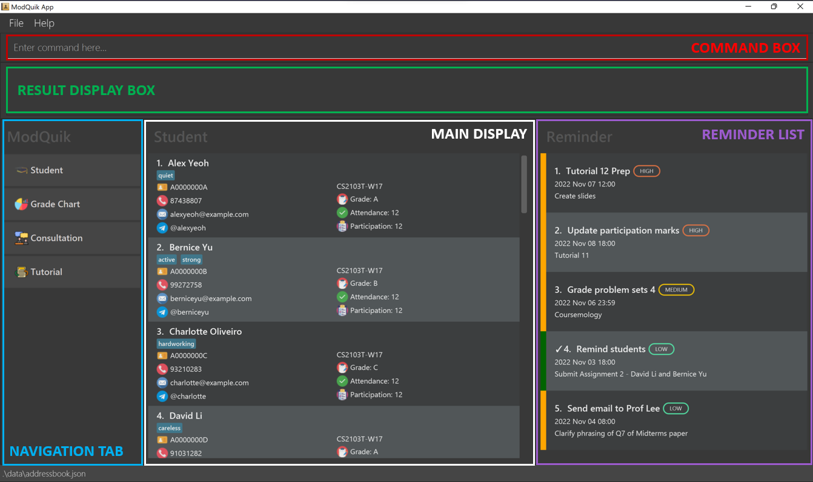
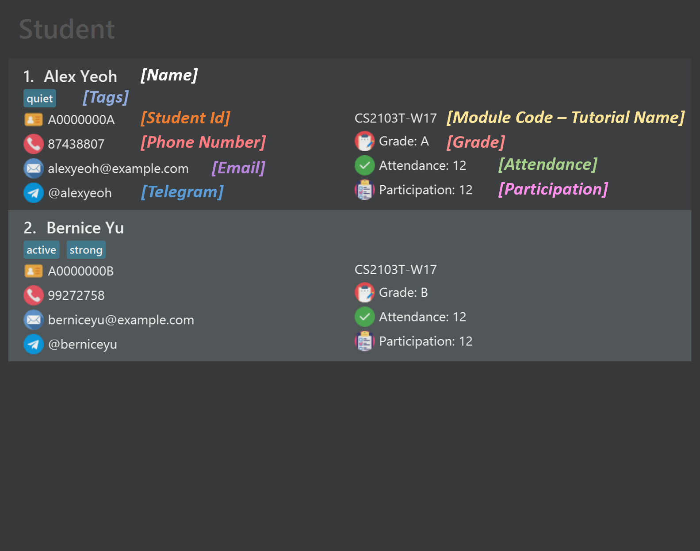
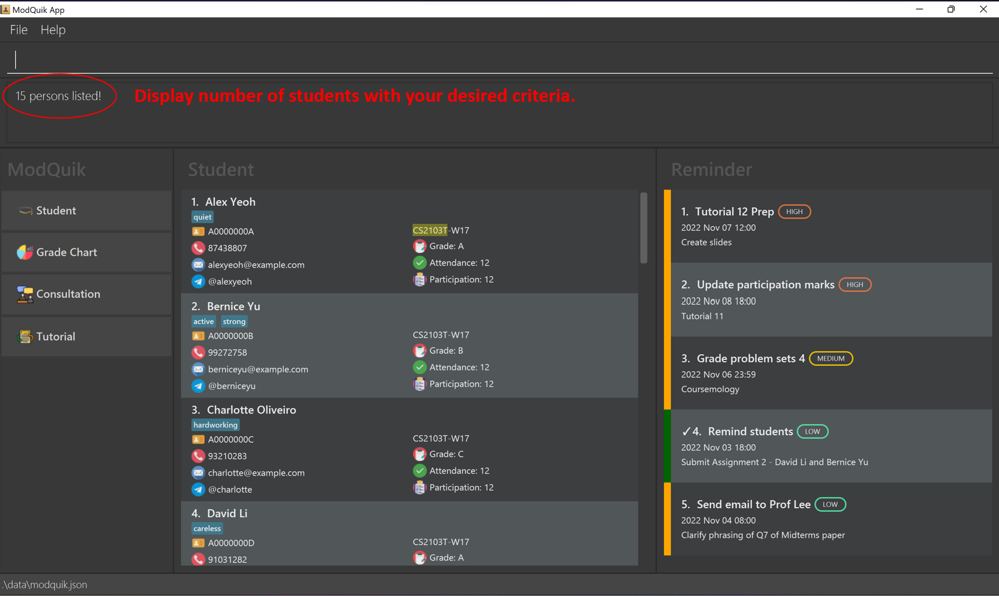
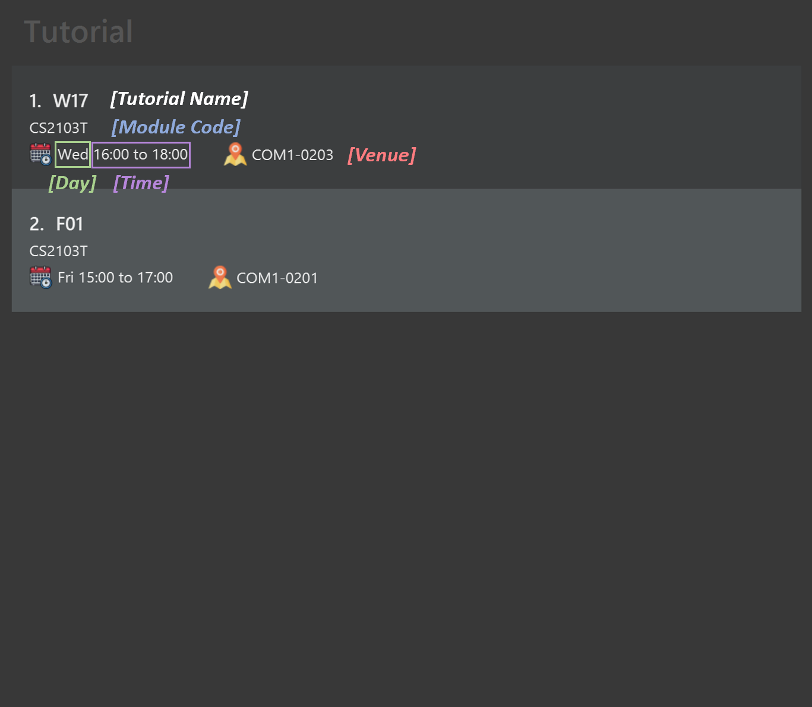
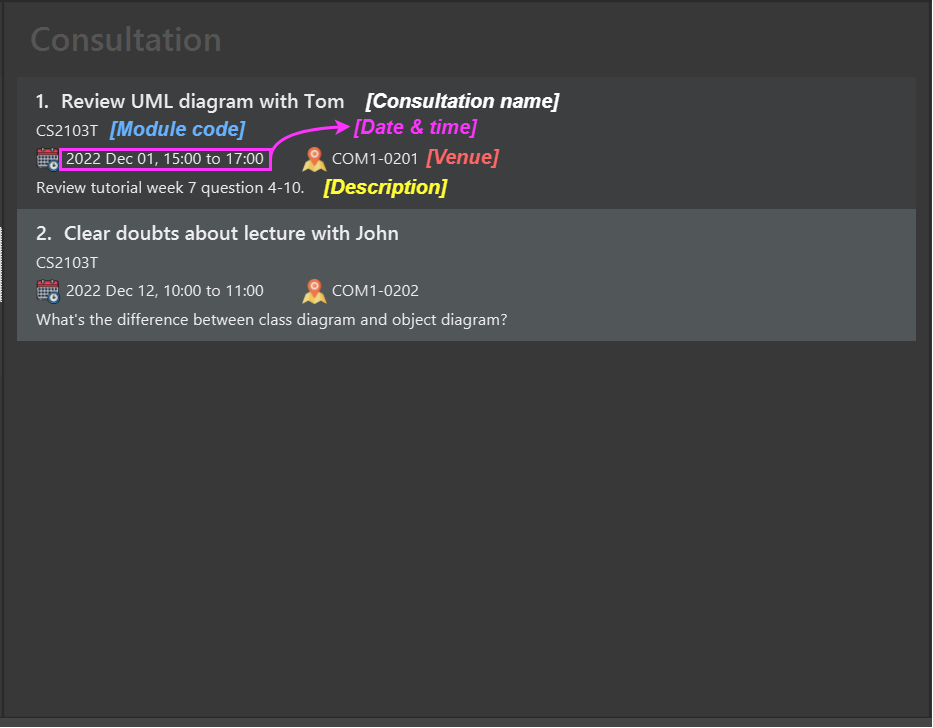
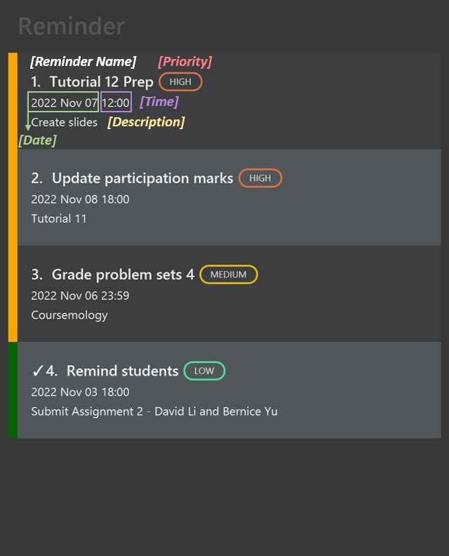
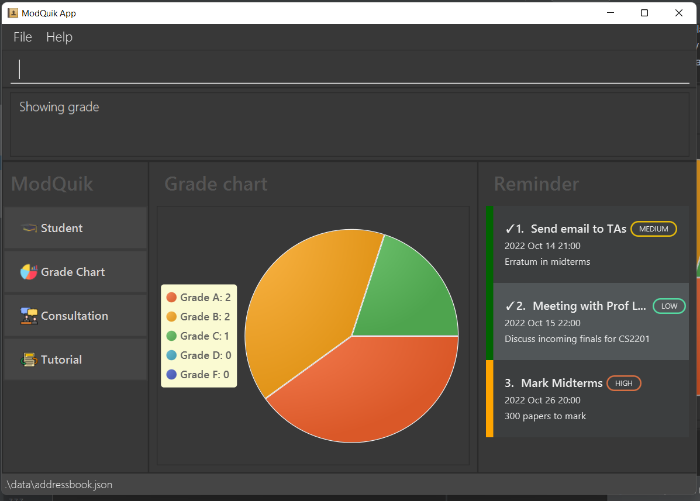

## 1. Introduction
Are you a Teaching Assistant (TA) struggling to monitor your classes and what tasks you have to complete?
Tired of having to use multiple applications (such as LumiNUS and Todoist) to keep track of all your responsibilities?<br>

Introducing ModQuik, a Teaching Assistant tool made for you!

ModQuik is a convenient tool that allows you to keep track of your classes, monitor your students' grades and set up reminders for your tasks (such as creating tutorial slides or marking homework). 
ModQuik is optimised for use via a Command Line Interface (CLI) while still having the benefits of a Graphical User Interface (GUI).
If you can type fast, ModQuik can get your lesson management tasks done faster than traditional GUI apps.

* Table of Contents
{:toc}

--------------------------------------------------------------------------------------------------------------------

## 2. Quick start

1. Ensure you have Java `11` or above installed in your Computer. For more instructions, click [here](installing-java-11).

1. Download the latest `modquik.jar` [here](https://github.com/AY2223S1-CS2103T-W17-3/tp/releases).

1. Copy the file to the folder you want to use as the _home folder_ for your ModQuik.

1. Double-click the file to start the app. The GUI as shown below should appear in a few seconds. Note how the app contains some sample data.<br>
   

1. Type the command in the command box and press Enter to execute it. e.g. typing **`help`** and pressing Enter will open the help window.<br>
   Some example commands you can try:

    * **[`list`]**: Lists all students.

    * **[`add student`]**`n/John Doe i/A0232123X ph/98765432 e/johnd@example.com tele/johnDoe m/CS2103T tut/W17`: Adds a student named `John Doe` to CS2103T module.

    * **[`delete student`]**`3`: Deletes the 3rd student shown in the current list displayed.

    * **[`switch`]**`f/grade`: Switch the tab to view the grade charts for the respective modules you teach.

    * **[`clear`]**`f/reminder`: Deletes all your reminders.

    * **[`exit`]**: Exits the app.

1. Refer to the [Features](#features) below for details of each command.

--------------------------------------------------------------------------------------------------------------------

## 3. About this User Guide
This guide aims to
* Teach first-time users how to start using ModQuik
* Explain the features of each command and how to use them.
* Provides a summary of the:
  * available commands with their respective formats
  * available prefixes and which commands use which prefixes

### 3.1 Navigating the User Guide
**Information Box**
<div markdown="block" class="alert alert-info">
**:information_source: Info:** I am an example info box! I provide useful information.
</div>

**Tip Box**
<div markdown="block" class="alert alert-success">
**:bulb: Tip:** I am an example tip box! I provide pointers to advanced users to enhance experience.
</div>

**Warning Box**
<div markdown="block" class="alert alert-danger">
**:exclamation: Warning:** I am an example warning box! I show important messages to take note to avoid any unintended effects.
</div>

**Highlights** <br>
Highlighted text refers to commands, parameters, fields values or any user inputs.
e.g. [`commands`](glossary) [`PARAMETERS`](glossary)

--------------------------------------------------------------------------------------------------------------------

## 4. GUI overview



**<span style="color:red;">Command Box</span>**<br>
Enter your command here.

**<span style="color:mediumseagreen;">Result Display Box</span>**<br>
Displays a feedback message after a command is executed.

**<span style="color:dodgerblue;">Navigation Tab</span>**<br>
Displays the tabs that you can navigate to.

**<span style="color:grey;">Main Display</span>**<br>
Displays the list of your chosen tab.

**<span style="color:purple;">Reminder List</span>**<br>
Displays your list of reminders.

--------------------------------------------------------------------------------------------------------------------

## 5. Features


<div markdown="block" class="alert alert-info">

**:information_source: Notes about the command format:**<br>

* Words in `UPPER_CASE` are the parameters to be supplied by the user.<br>
  e.g. in `add student n/NAME`, `NAME` is a parameter which can be used as `add student n/John Doe`.

* Items in square brackets are optional.<br>
  e.g. `n/NAME [t/TAG]` can be used as `n/John Doe t/friend` or as `n/John Doe`.

* Items with `…` after them can be used multiple times including zero times.<br>
  e.g. `[t/TAG]…` can be used as ` ` (i.e. 0 times), `t/friend`, `t/friend t/family` etc.

* Parameters can be in any order.<br>
  e.g. if the command specifies `n/NAME ph/PHONE`, `ph/PHONE n/NAME` is also acceptable.

* If a parameter is expected only once in the command, but you specified it multiple times, only the last occurrence of the parameter will be taken.<br>
  e.g., if you specify `ph/12341234 ph/56785678`, only `ph/56785678` will be taken.

* Inapplicable parameters for commands that do not take in parameters (such as [`help`] and [`exit`]) will be ignored.<br>
  e.g., if the command specifies `help 123`, it will be interpreted as `help`.


</div>

### 5.1 Student Features



<a name="add-student"></a>
#### 5.1.1 Adding a student: `add student`

Adds a student to the specified module.

Format: `add student n/NAME i/STUDENT_ID ph/PHONE e/EMAIL tele/TELEGRAM_HANDLE m/MODULE tut/TUTORIAL [g/GRADE] [att/ATTENDANCE] [part/PARTICIPATION] [t/TAG]…`

* `PHONE` should be 8 digits long as per standard telephone numbers in Singapore.
* `STUDENT_ID` should follow the following format AXXXXXXXY, where X is a number, and Y is an alphabet.
* `TELEGRAM_HANDLE` follows the format of a username on Telegram, taking in a-z, 0-9 and underscores.
* `MODULE` takes in the module code YY[Y]XXXX[Y], where X is a number, and Y is an alphabet. [Y] indicates an optional alphabet.
* `ATTENDANCE` and `PARTICIPATION` can only take in integers greater than 0. If a value is not given, they will automatically be set to 0.
* `GRADE` can take in `A`, `B`, `C`, `D`, `F`. If a value is not given, it will automatically be set to `PENDING...`.

<div markdown="span" class="alert alert-success">:bulb: **Tip:**
A student can have any number of tags (including 0).
</div>

Examples:
1. `add student n/Betsy Crowe i/A0000000B t/struggling e/betsycrowe@example.com ph/91234567 tele/betsy_crowe m/CS2105 tut/G03 att/3 part/1 g/C t/quiet`
2. `add student n/John Doe i/A0232123X ph/98765432 e/johnd@example.com tele/johnDoe m/CS2103T tut/W17`

<table>
  <tr>
    <td>Before (example 2)</td>
    <td>After (example 2)</td>
  </tr>
  <tr>
    <td></td>
    <td></td>
  </tr>
 </table>

<a name="list"></a>
#### 5.1.2 Listing all students: `list`

Shows a list of all students in ModQuik.

* If the list of students is not currently active, it may appear that the command does not have any effect. Navigate to the `Student` tab to see the list of students.

<div markdown="span" class="alert alert-success">:bulb: **Tip:**
To switch between tabs, you can click on `Tab` button to switch between the different tabs (`Student`, `Grade Chart`, `Consultation`, `Tutorial`) and the command box.
Alternatively, you can use the [`switch`] command if you would like to only use the keyboard.
</div>

Format: `list`

<a name="edit-student"></a>
#### 5.1.3 Editing a student: `edit student`

Edits an existing student in a specified module.

Format: `edit student INDEX [n/NAME] [i/STUDENT_ID] [ph/PHONE] [e/EMAIL] [tele/TELEGRAM_HANDLE] [m/MODULE] [tut/TUTORIAL] [g/GRADE] [att/ATTENDANCE] [part/PARTICIPATION] [t/TAG]…`

<div markdown="span" class="alert alert-success">:bulb: **Tip:**
You may want to use this command to:<br>
- Update your student's grade after an assessment<br>
- Update your student's attendance and participation score after a lesson<br>
- Update your student's particulars<br>
</div>

* Edits the student at the specified `INDEX`. The index refers to the index number shown in the displayed student list. The index **must be a positive integer** 1, 2, 3, …
* At least one of the optional fields must be provided.
* Existing values will be updated to the input values.
* When editing tags, the existing tags of the student will be removed i.e. adding of tags is not cumulative.
* You can remove all the student’s tags by typing `t/` without
  specifying any tags after it.
* If nothing is given to `GRADE` even though `g/` is typed into the command box, it will automatically be set to `PENDING...`.
* If nothing is given to `ATTENDANCE` even though `att/` is typed into the command box, it will automatically be set to `0`.
* If nothing is given to `PARTICIPATION` even though `part/` is typed into the command box, it will automatically be set to `0`.

Examples:
1. `edit student 1 ph/91234567 e/jameslee@example.com` Edits the phone number and email address of the 1st student to be `91234567` and `jameslee@example.com` respectively.
2. `edit student 2 g/A t/` Edits the grade of the 2nd student to be `A` and clears all existing tags.

<table>
  <tr>
    <td>Before (example 2)</td>
    <td>After (example 2)</td>
  </tr>
  <tr>
    <td></td>
    <td></td>
  </tr>
 </table>

* [`find`] `m/CS2103T` followed by `edit student 2 g/A` Edits the grade of the 2nd student to be `A` in the results of the [`find`] command.


<a name="find"></a>
#### 5.1.4 Locating students by their attributes: `find`

Find students by name, student ID, module or tutorial, by checking if respective criteria contains any of the given keywords.

Format: `find [n/NAME] [i/STUDENT_ID] [m/MODULE] [tut/TUTORIAL]`

* At least one of the optional fields must be provided.
* The search is case-insensitive. e.g. `hans` will match `Hans`
* The order of the keywords does not matter. e.g. `Hans Bo` will match `Bo Hans`
* Only full words will be matched e.g. `Han` will not match `Hans`
* Students matching at least one keyword will be returned (i.e. `OR` search).
  e.g. `Hans Bo` will return `Hans Gruber`, `Bo Yang`
* `find` across different prefixes is a `AND` search.
e.g. `find n/John m/CS2105` will return students matching `John` who are also in `CS2105`, if the students exist in ModQuik.
* `find` works on the entire list of students and successive find commands are independent of each other.
e.g. `find n/John` followed by find `find m/CS2103` will not find students matching `John` in `CS2103`.
It will first display all students matching `John`, then display all students in `CS2103`.

Examples:
1. `find n/John` returns `john` and `John Doe`
2. `find m/CS2103T` returns list of students in CS2103T



<a name="delete-student"></a>
#### 5.1.5 Deleting a student: `delete student`

Deletes the specified student from the list of students.

<div markdown="span" class="alert alert-success">:bulb: **Tip:**
You may want to use this command if any students drop out of the module or change tutorial groups.
</div>

Format: `delete student INDEX`

* Deletes the student at the specified `INDEX`.
* The index refers to the index number shown in the displayed student list.
* The index **must be a positive integer** 1, 2, 3, …

Examples:
1. [`list`] followed by `delete student 2` deletes the 2nd student in the list of people.
2. [`find`] `n/Betsy` followed by `delete student 1` deletes the 1st student in the results of the [`find`] command.
3. [`find`] `m/CS2103T` followed by `delete student 2` deletes the 2nd student in the results of the [`find`] command.

<a name="extract-emails"></a>
#### 5.1.6 Extracting student's emails: `extract emails`

Copies all emails in the displayed student list onto the clipboard.

<div markdown="span" class="alert alert-success">:bulb: **Tip:**
You may want to use this command to email a student or a selected group of students (e.g. those with grade C).
</div>

Format: `extract emails`

<div markdown="span" class="alert alert-info">:information_source: **How to use:**<br>
    1. Execute the `extract emails` command in the ModQuik command box. The following message will be displayed in the Results Display Box: <br>
    
    <br><br>
    2. A link will be copied onto your clipboard. Go to your web browser and paste the emails onto your address bar. Your mail app will be prompted to open.
    
    <br><br>
    3. All the emails should be pasted as shown:<br>
    
</div>

Examples:
1. [`find`] `m/CS2103T` followed by `extract emails` copies all the emails of the students in the results of the [`find`] command.


### 5.2 Tutorial Features



<a name="add-tutorial"></a>
#### 5.2.1 Adding a tutorial: `add tutorial`

Adds a tutorial to ModQuik.

Format: `add tutorial n/NAME m/MODULE v/VENUE T/TIMESLOT D/DAY`
* `DAY` takes in a number from 1 (Monday) to 7 (Sunday).
* `TIMESLOT` takes in a start time to end time in the format HH:mm-HH:mm, e.g., 18:00-20:00.
* The system does not allow adding duplicate tutorials - as defined as the tutorial having the same name and same module, ignoring case.

Examples:
1. `add tutorial n/T23 m/CS2103T v/COM1-0205 T/18:00-20:00 D/1`

<table>
  <tr>
    <td>Before</td>
    <td>After</td>
  </tr>
  <tr>
    <td></td>
    <td></td>
  </tr>
</table>

<a name="edit-tutorial"></a>
#### 5.2.2 Editing a tutorial: `edit tutorial`

Edits an existing tutorial in ModQuik.

<div markdown="span" class="alert alert-success">:bulb: **Tip:**
You may want to use this command to update your tutorials when there are changes in venue e.g., from zoom to offline or vice versa.
</div>

Format: `edit tutorial INDEX [n/NAME] [m/MODULE] [v/VENUE] [T/TIMESLOT] [D/DAY]`

* Edits the tutorial at the specified `INDEX`. The index refers to the index number shown in the displayed tutorial list. The index **must be a positive integer** 1, 2, 3, …
* At least one of the optional fields must be provided.
* Existing values will be updated to the input values.
* When editing the timeslot or the day, both fields must be given.

Examples:
1. `edit tutorial 2 v/Zoom T/14:00-16:00 D/5` Edits the venue of the 2nd tutorial to be `Zoom`, sets tutorial time to be `14:00 to 16:00` and sets tutorial day to be `Fri`.

<table>
  <tr>
    <td>Before</td>
    <td>After</td>
  </tr>
  <tr>
    <td></td>
    <td></td>
  </tr>
 </table>

<a name="delete-tutorial"></a>
#### 5.2.3 Deleting a tutorial: `delete tutorial`

Deletes a specified tutorial from ModQuik.

Format: `delete tutorial INDEX`

* Deletes the tutorial at the specified `INDEX`.
* The index refers to the index number shown in the displayed tutorial list.
* The index **must be a positive integer** 1, 2, 3, …

Examples:
1. `delete tutorial 2`

### 5.3 Consultation Features



<a name="add-consultation"></a>
#### 5.3.1 Adding a consultation: `add consultation`

Adds a consultation slot at the given time, date, place and description to ModQuik.

Format: `add consultation n/NAME m/MODULE v/VENUE D/DATE T/TIMESLOT d/DESCRIPTION`
* `DATE` should be given in the format yyyy-MM-dd, e.g. 2022-10-24.
* `TIMESLOT` takes in a start time to end time in the format HH:mm-HH:mm, e.g., 18:00-20:00.
* You can add consultations from the past to keep track of all your consultations and progress throughout the semester.
* In rare cases, ModQuik will autocorrect invalid dates. See [here](#notes-autocorrect-dates) for more details.

Examples:
1. `add consultation n/Review past year paper m/CS2103T v/COM2-0109 D/2022-12-12 T/16:00-18:00 d/AY2019-2020 Question 3,6,8`

<table>
  <tr>
    <td>Before</td>
    <td>After</td>
  </tr>
  <tr>
    <td></td>
    <td></td>
  </tr>
 </table>

<a name="edit-consultation"></a>
#### 5.3.2 Editing a consultation: `edit consultation`

Edits an existing consultation in ModQuik.

<div markdown="span" class="alert alert-success">:bulb: **Tip:**
You may want to use this command to edit the date and time of your consultation, or add in questions your student want to ask you in the description closer to the date of consultation.
</div>

Format: `edit consultation INDEX [n/NAME] [m/MODULE] [v/VENUE] [T/TIMESLOT] [D/DATE] [d/DESCRIPTION]`

* Edits the consultation at the specified `INDEX`. The index refers to the index number shown in the displayed consultation list. The index **must be a positive integer** 1, 2, 3, …
* At least one of the optional fields must be provided.
* Existing values will be updated to the input values.
* When editing the timeslot or the date, both fields must be given.
* In rare cases, ModQuik will autocorrect invalid dates. See [here](#notes-autocorrect-dates) for more details.

Examples:
1. `edit consultation 2 T/14:00-16:00 D/2023-11-21` Edits the timeslot of the 2nd consultation to be `14:00 to 16:00` and sets consultation date to `2023 Nov 21`.
2. `edit consultation 1 v/Zoom` Edits the venue of the 1st consultation to be `Zoom`.

<table>
  <tr>
    <td>Before</td>
    <td>After (example 2)</td>
  </tr>
  <tr>
    <td></td>
    <td></td>
  </tr>
</table>

<a name="delete-consultation"></a>
#### 5.3.3 Deleting a consultation: `delete consultation`

Deletes a specified consultation from ModQuik.

Format: `delete consultation INDEX`

* Deletes the consultation at the specified `INDEX`.
* The index refers to the index number shown in the displayed consultation list.
* The index **must be a positive integer** 1, 2, 3, …

Examples:
1. `delete consultation 3`

### 5.4 Reminder Features



<a name="add-reminder"></a>
#### 5.4.1 Adding a reminder: `add reminder`

Adds a reminder to ModQuik. You can add reminders such as "Mark Assignment 1" by a specified deadline.

Format: `add reminder n/NAME T/TIME D/DATE p/PRIORITY d/DESCRIPTION `

* `PRIORITY` is case-insensitive and can only be either `HIGH`, `MEDIUM` or `LOW`.
* `DATE` should be given in the format yyyy-MM-dd, e.g. 2022-10-24.
* `TIME` should be given in the format HH:mm, e.g., 18:00.
* You can add reminders from the past to keep track of all your tasks and progress throughout the semester.
* You cannot add 2 reminders of the same name, date, time and description as they are considered duplicate.
* Whenever a reminded is added, it will be **automatically sorted by priority**, just like when `sort reminder by/priority` is used so that the tasks deemed most important are shown at the top of the list.
* In rare cases, ModQuik will autocorrect invalid dates. See [here](#notes-autocorrect-dates) for more details.


Examples:
1. `add reminder n/Mark Midterms D/2023-01-01 T/15:00 d/30 papers to mark p/HIGH`
2. `add reminder n/Update Grades T/16:00 D/2023-01-01 d/20 students to update p/MEDIUM`

<table>
  <tr>
    <td>Before</td>
    <td>After (example 2)</td>
  </tr>
  <tr>
    <td></td>
    <td></td>
  </tr>
</table>

<a name="edit-reminder"></a>
#### 5.4.2 Editing a reminder: `edit reminder`

Edits an existing reminder in ModQuik.

<div markdown="span" class="alert alert-success">:bulb: **Tip:**
You may want to add this command to edit any field of an existing reminder in the event that there are changes, such as extension of a deadline.
</div>

Format: `edit reminder INDEX [n/NAME] [T/TIME] [D/DATE] [p/PRIORITY] [d/DESCRIPTION] `

* Edits the reminder at the specified `INDEX`. The index refers to the index number shown in the displayed reminder list. The index **must be a positive integer** 1, 2, 3, …
* At least one of the optional fields must be provided.
* Existing values will be updated to the input values.
* `PRIORITY` is case-insensitive and can only be either `HIGH`, `MEDIUM` or `LOW`.
* When editing the `DATE` or `TIME`, both fields must be given.
* In rare cases, ModQuik will autocorrect invalid dates. See [here](#notes-autocorrect-dates) for more details.


Examples:
1. `edit reminder 1 p/LOW` Edits the priority of the 1st reminder to be `LOW`.
2. `edit reminder 2 T/14:00 D/2023-11-17` Edits the time of the 2nd reminder to be `14:00` and the date to `2023 Nov 17`.

<table>
  <tr>
    <td>Before (example 2)</td>
    <td>After (example 2)</td>
  </tr>
  <tr>
    <td></td>
    <td></td>
  </tr>
</table>

<a name="mark-reminder"></a>
#### 5.4.3 Mark a reminder: `mark reminder`

Sets the reminder status as _completed_.

<div markdown="span" class="alert alert-info">:information_source: **Info:**
Reminders that have been completed have a green sidebar and a tick on the left of their name. Reminders that are yet to be done have a yellow sidebar.
</div>

Format: `mark reminder INDEX`

Examples:
1. `mark reminder 2`

<table>
  <tr>
    <td>Before</td>
    <td>After</td>
  </tr>
  <tr>
    <td></td>
    <td></td>
  </tr>
 </table>

<a name="unmark-reminder"></a>
#### 5.4.4 Unmark a reminder: `unmark reminder`

Sets a reminder status as _incomplete_.

Format: `unmark reminder INDEX`

Examples:
1. `unmark reminder 3`

<a name="delete-reminder"></a>
#### 5.4.5 Deleting a reminder: `delete reminder`

Deletes the specified reminder from ModQuik. Users can delete a reminder if they think it is no longer relevant.

Format: `delete reminder INDEX`

* Deletes the reminder at the specified `INDEX`.
* The index refers to the index number shown in the displayed reminder list.
* The index **must be a positive integer** 1, 2, 3, …

Examples:
1. `delete reminder 3`

<a name="sort-reminder"></a>
#### 5.4.6 Sort reminders: `sort reminder`

Sort reminders by a chosen criteria. Users would be able to view the list of reminders based on the criteria they want.

Format: `sort reminder by/SORT_CRITERIA`

* `SORT_CRITERIA` must either be `priority` or `deadline`.
* Specifying `priority` will sort reminders by their priority, with `HIGH` on top of the list, followed by `MEDIUM` and `LOW`.
  Reminders with the same priority will then be sorted by date, from earliest to latest chronologically.
  At a glance, the user can see how many reminders are still pending or already completed for each priority.
* Specifying `deadline` will sort reminders by their deadline, with the earliest date on top of the list.
  Reminders with the same deadline will then be sorted by descending priority level, with the same order as stated above.
* Reminders with the same priority and deadline will then be sorted lexicographically.
* Sorting does not take reminders' status into account.

Examples:
1. `sort reminder by/priority`
2. `sort reminder by/deadline`

<table>
  <tr>
    <td>Sort reminder by priority</td>
    <td>Sort reminder by deadline</td>
  </tr>
  <tr>
    <td></td>
    <td></td>
  </tr>
 </table>

<a name="switch"></a>
### 5.5 Switch tabs: `switch`

Switch command allows users to navigate between different tabs without the mouse which is crucial for our application as the target user are fast-typists who prefer typing over other means of input.

Format: `switch f/FIELD`

* `FIELD` includes: `student`, `tutorial`, `consultation`, `grade`

Examples:
* `switch f/tutorial` will switch tabs and display the tutorial list.
* `switch f/grade` with switch tabs and display a pie chart showing an overview of the number of students in each grade category.


_Figure 2. Grade Chart Tab_

<a name="clear"></a>
### 5.6 Clearing data: `clear`

Clears all existing data in a specific field (including student, tutorial, reminder and consultation) or the entire app. 

For example, user might choose to reset the data when the semester ends to prepare for the upcoming semester.

Format: `clear f/FIELD`
* `FIELD` including `all`, `student`, `tutorial`, `consultation`, `reminder`

<div markdown="span" class="alert alert-danger">:exclamation: **Warning:**
Take note that this action is irreversible.
</div>

Examples:
* `clear f/all`

<a name="help"></a>
### 5.7 Viewing help: `help`
Shows a message explaining how to access the help page.

Format: `help`

<a name="edit"></a>
### 5.8 Exiting the program: `exit`

Exits the program.

Format: `exit`

### 5.9 Saving the data

All data in ModQuik is saved in the hard disk automatically after executing any command that changes the data. There is no need to save manually.

### 5.10 Editing the data file

All data in ModQuik is saved as a JSON file `[JAR file location]/data/modquik.json`. Advanced users are welcome to update data directly by editing that data file.

<div markdown="span" class="alert alert-danger">:exclamation: **Warning:**
If your changes to the data file makes its format invalid, ModQuik will discard all data and start with an empty data file at the next run.
</div>

### 5.11 Archiving data files `[coming in v2.0]`

_Details coming soon..._

### 5.12 Add existing student into multiple modules `[coming in v2.0]`

_Details coming soon..._

--------------------------------------------------------------------------------------------------------------------

## 6. FAQ

**Q**: How do I transfer my data to another Computer?<br>
**A**: Install the app in the other computer and overwrite the empty data file it creates with the file that contains the data of your previous ModQuik home folder.

**Q**: How do I toggle between tabs at the side panel?<br>
**A**: Method 1: Use the [**switch tabs**][`switch`] command.<br>
       Method 2: Click on the `Tab` button, and it will toggle between all 4 tabs (**Student**, **Grade Chart**, **Consultation**, **Tutorial**).

--------------------------------------------------------------------------------------------------------------------

## 7. Appendix

<a name="glossary"></a>
### 7.1 Glossary

| Term                               | Description                                                                                                                                                                                    |
|------------------------------------|------------------------------------------------------------------------------------------------------------------------------------------------------------------------------------------------|
| **Command Line Interface (CLI)**   | User interface that allows users to use text as commands to be executed by an application.                                                                                                     |
| **Graphical User Interface (GUI)** | User interface that allows users to interact with an application through graphics and visuals                                                                                                  |
| **Command**                        | User-specified instruction that ModQuik will execute.<br> e.g., `add student` and `find`                                                                                                       |
| **Parameter**                      | A component of the command that the user will need to input.<br> e.g., `sort reminder by/deadline` where deadline is the parameter.                                                            |
| **Prefix**                         | Abbreviation of the name of the parameter followed by a `/`. User will need to type the prefix before the parameter in ModQuik.<br> e.g., `sort reminder by/deadline` where by/ is the prefix. |
| **Lexicographically**              | Generalization of the alphabetical order of the dictionaries                                                                                                                                   |

### 7.2 Notes

<a name="installing-java-11"></a>
#### 7.2.1 Instructions on installing Java 11
1. Check that you have Java 11 installed by running `java --version` in your terminal. The output should similar to this:
```
openjdk 11.0.12 2021-07-20 LTS
OpenJDK Runtime Environment Zulu11.50+19-CA (build 11.0.12+7-LTS)
OpenJDK 64-Bit Server VM Zulu11.50+19-CA (build 11.0.12+7-LTS, mixed mode)
```
1. If Java 11 is not installed, visit [this site](https://www.oracle.com/java/technologies/downloads/#java11) to download.
1. Repeat step 1 to ensure Java 11 has been installed correctly.

<a name="notes-autocorrect-dates"></a>
#### 7.2.2 Note on autocorrecting invalid dates

ModQuik will assume some invalid dates to be correct and autocorrect the date to the last valid day of that month. See the below examples for a better explanation.

Examples:
* `add reminder n/mark papers D/2022-11-31 T/13:00 p/HIGH d/300 papers to mark` will set a reminder on 2022 Nov 30 instead. ModQuik reasonably assumes that the user wishes to set the date on the last day of November.
* `add reminder n/mark papers D/2023-02-29 T/13:00 p/HIGH d/300 papers to mark` will set a reminder on 2023 Feb 28 instead, since 2023 is not a leap year, with 2023 February having 28 days.
* `add reminder n/mark papers D/2024-02-30 T/13:00 p/HIGH d/300 papers to mark` will set a reminder on 2024 Feb 29 instead, since 2024 is a leap year, with 2024 February having 29 days.
* `add reminder n/mark papers D/2022-11-32 T/13:00 p/HIGH d/300 papers to mark` will show an error instead. This is because none of the months have 32 days, and the date is more likely to be a user typo.


### 7.3 Command summary

| Action                                           | Format, Examples                                                                                                                                                                                                                                           |
|--------------------------------------------------|------------------------------------------------------------------------------------------------------------------------------------------------------------------------------------------------------------------------------------------------------------|
| [**Add Student**][`add student`]                 | `add student n/NAME i/STUDENT_ID ph/PHONE e/EMAIL tele/TELEGRAM_HANDLE m/MODULE tut/TUTORIAL [att/ATTENDANCE] [part/PARTICIPATION] [t/TAG]…`<br> e.g., `add student n/John Doe i/A0000000J ph/98765432 e/johnd@example.com tele/johnDoe m/CS2103T tut/W17` |
| [**List All Students**][`list`]                  | `list`                                                                                                                                                                                                                                                     |
| [**Edit Student**][`edit student`]               | `edit student INDEX [n/NAME] [i/STUDENT_ID] [ph/PHONE] [e/EMAIL] [tele/TELEGRAM_HANDLE] [m/MODULE] [tut/TUTORIAL] [att/ATTENDANCE] [part/PARTICIPATION] [t/TAG]…`<br> e.g., `edit student 1 ph/91234567 e/jameslee@example.com`                            |
| [**Find**][`find`]                               | `find [n/NAME] [i/STUDENT_ID] [m/MODULE] [tut/TUTORIAL]`<br> e.g., `find n/john m/CS2103T`                                                                                                                                                                 |
| [**Delete Student**][`delete student`]           | `delete student INDEX`<br> e.g., `delete student 2`                                                                                                                                                                                                        |
| [**Extract Student Emails**][`extract emails`]   | `extract emails`                                                                                                                                                                                                                                           |
| [**Add Tutorial**][`add tutorial`]               | `add tutorial n/NAME m/MODULE v/VENUE T/TIMESLOT D/DAY`<br> e.g., `add tutorial n/T23 m/CS2103T v/COM1-0205 T/18:00-20:00 D/1`                                                                                                                             |
| [**Edit Tutorial**][`edit tutorial`]             | `edit tutorial INDEX [n/NAME] [m/MODULE] [v/VENUE] [T/TIMESLOT] [D/DAY]`<br> e.g., `edit tutorial 1 n/W17 m/CS2103T`                                                                                                                                       |
| [**Delete Tutorial**][`delete tutorial`]         | `delete tutorial INDEX`<br> e.g., `delete tutorial 3`                                                                                                                                                                                                      |
| [**Add Consultation**][`add consultation`]       | `add consultation n/NAME m/MODULE v/VENUE D/DATE T/TIMESLOT d/DESCRIPTION`<br> e.g., `add consultation n/Review past year paper m/CS2103T v/COM2-0109 D/2022-12-12 T/16:00-18:00 d/AY2019-2020 Question 3,6,8`                                             |
| [**Edit Consultation**][`edit consultation`]     | `edit consultation INDEX`<br> e.g., `edit consultation 3 d/Review past year paper`                                                                                                                                                                         |
| [**Delete Consultation**][`delete consultation`] | `delete consultation INDEX`<br> e.g., `delete consultation 3`                                                                                                                                                                                              |
| [**Add Reminder**][`add reminder`]               | `add reminder n/NAME D/DATE T/TIME p/PRIORITY d/DESCRIPTION`<br> e.g., `add reminder n/mark papers D/2023-03-21 T/13:00 p/HIGH d/300 papers to mark`                                                                                                       |
| [**Edit Reminder**][`edit reminder`]             | `edit reminder INDEX [n/NAME] [D/DATE] [T/TIME] [p/PRIORITY] [d/DESCRIPTION]`<br> e.g., `edit reminder 1 D/2023-01-01 T/14:00`                                                                                                                             |
| [**Mark Reminder**][`mark reminder`]             | `mark reminder INDEX`<br> e.g., `mark reminder 3`                                                                                                                                                                                                          |
| [**Unmark Reminder**][`unmark reminder`]         | `unmark reminder INDEX`<br> e.g., `unmark reminder 3`                                                                                                                                                                                                      |
| [**Delete Reminder**][`delete reminder`]         | `delete reminder INDEX`<br> e.g., `delete reminder 3`                                                                                                                                                                                                      |
| [**Sort Reminder**][`sort reminder`]             | `sort reminder by/SORT_CRITERIA`<br> e.g., `sort reminder by/deadline`                                                                                                                                                                                     |
| [**Switch Tabs**][`switch`]                      | `switch f/FIELD`<br> e.g., `switch f/tutorial`                                                                                                                                                                                                             |
| [**Clear**][`clear`]                             | `clear f/FIELD`<br> e.g., `clear f/student`                                                                                                                                                                                                                |
| [**Help**][`help`]                               | `help`                                                                                                                                                                                                                                                     |
| [**Exit**][`exit`]                               | `exit`                                                                                                                                                                                                                                                     |


### 7.4 Prefix summary

* The prefixes `D/` and `T/`, have more than 1 definition, depending on the type of command inputted.

| Prefix    | Symbolises       | Used in                                                                                                                                                                                    |
|-----------|------------------|--------------------------------------------------------------------------------------------------------------------------------------------------------------------------------------------|
| **att/**  | attendance       | [`add student`]<br> [`edit student`]                                                                                                                                                       |
| **by/**   | sorting criteria | [`sort reminder`]                                                                                                                                                                          |
| **d/**    | description      | [`add consultation`]<br> [`edit consultation`]<br> [`add reminder`]<br> [`edit reminder`]                                                                                                  |
| **D/**    | date or day      | [`add consultation`] (`DATE`) <br> [`edit consultation`] (`DATE`)<br> [`add reminder`] (`DAY`)<br> [`edit reminder`] (`DAY`)                                                               |
| **e/**    | email            | [`add student`]<br> [`edit student`]                                                                                                                                                       |
| **f/**    | field            | [`switch`]<br> [`clear`]                                                                                                                                                                   |
| **g/**    | grade            | [`add student`]<br> [`edit student`]                                                                                                                                                       |
| **i/**    | student id       | [`add student`]<br> [`edit student`]<br> [`find`]                                                                                                                                          |
| **m/**    | module           | [`add student`]<br> [`edit student`]<br> [`find`]<br> [`add tutorial`]<br> [`edit tutorial`]<br> [`add consultation`]<br> [`edit consultation`]                                            |
| **n/**    | name             | [`add student`]<br> [`edit student`]<br> [`find`]<br> [`add tutorial`]<br> [`edit tutorial`]<br> [`add consultation`]<br> [`edit consultation`]<br> [`add reminder`]<br> [`edit reminder`] |
| **p/**    | priority         | [`add reminder`]<br> [`edit reminder`]                                                                                                                                                     |
| **ph/**   | phone            | [`add student`]<br> [`edit student`]                                                                                                                                                       |
| **part/** | participation    | [`add student`]<br> [`edit student`]                                                                                                                                                       |
| **t/**    | tag              | [`add student`]<br> [`edit student`]                                                                                                                                                       |
| **T/**    | time or timeslot | [`add reminder`] (`TIME`)<br> [`edit reminder`] (`TIME`)<br> [`add consultation`] (`TIMESLOT`)<br> [`edit consultation`] (`TIMESLOT`)<br>                                                  |
| **tut/**  | tutorial         | [`add student`]<br> [`edit student`]<br> [`find`]<br> [`add tutorial`]<br> [`edit tutorial`]                                                                                               |
| **tele/** | Telegram handle  | [`add student`]<br> [`edit student`]                                                                                                                                                       |
| **v/**    | venue            | [`add tutorial`]<br> [`edit tutorial`]<br> [`add consultation`]<br> [`edit consultation`]                                                                                                  |

[`add student`]: #add-student
[`list`]: #list
[`edit student`]: #edit-student
[`find`]: #find
[`delete student`]: #delete-student
[`extract emails`]: #extract-emails
[`add tutorial`]: #add-tutorial
[`edit tutorial`]: #edit-tutorial
[`delete tutorial`]: #delete-tutorial
[`add consultation`]: #add-consultation
[`edit consultation`]: #edit-consultation
[`delete consultation`]: #delete-consultation
[`add reminder`]: #add-reminder
[`edit reminder`]: #edit-reminder
[`mark reminder`]: #mark-reminder
[`unmark reminder`]: #unmark-reminder
[`delete reminder`]: #delete-reminder
[`sort reminder`]: #sort-reminder
[`delete consultation`]: #delete-consultation
[`switch`]: #switch
[`clear`]: #clear
[`help`]: #help
[`exit`]: #exit

[glossary]: #glossary
